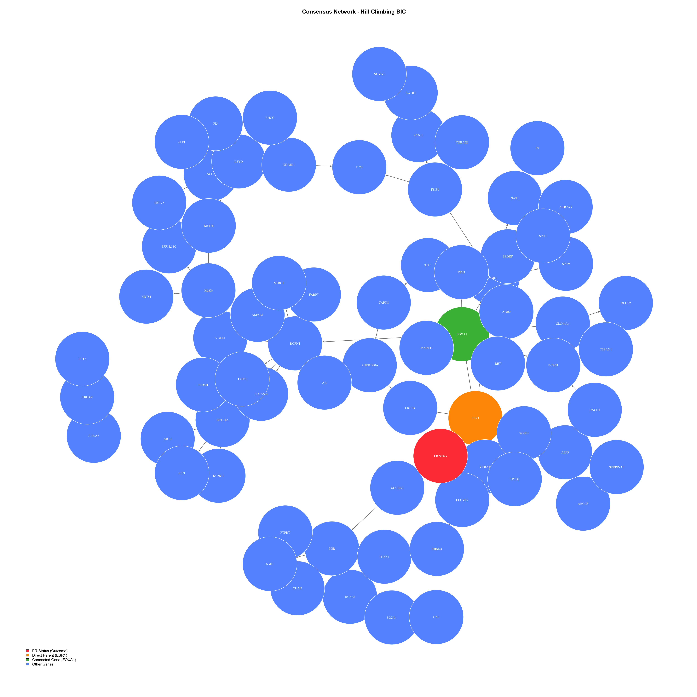
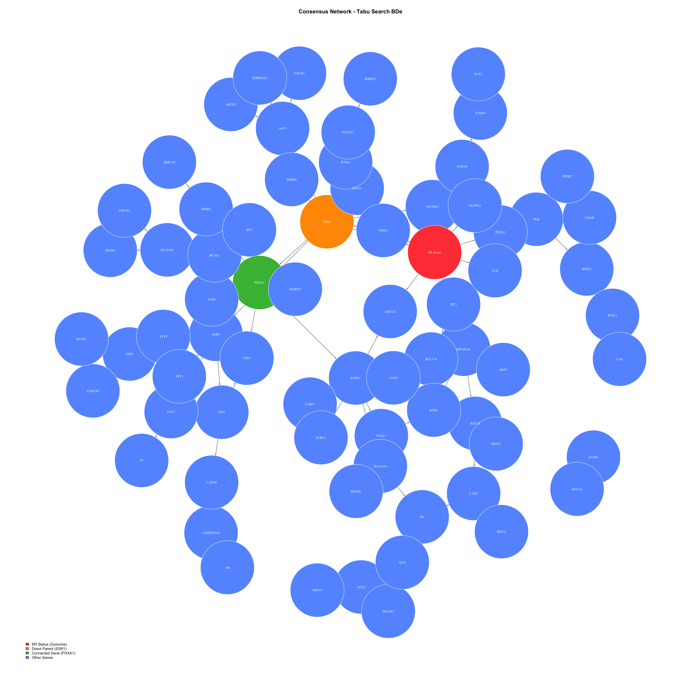

# STATS-205-PROJECT
# Causal Discovery in Cancer Gene Expression Data using Bayesian Networks

**Author:** Praavin Kumar Manickam Srinivasan  
**Course:** STATS-205P | University of California, Irvine  
**Email:** pmanicka@uci.edu

---

## Overview

Standard machine learning finds genes that **correlate** with ER Status in breast cancer but correlation is not causation. This project applies **Bayesian Networks** to RNA-seq gene expression data from 549 breast cancer patients from TCGA to move beyond correlation and identify which gene causally determines Estrogen Receptor (ER) Status and therefore whether hormone therapy will work for a patient.

The project successfully identifies **ESR1** as the direct causal gene determining ER protein production and therefore ER Status. However what causes ESR1 itself to behave differently between patients remains an open question requiring further experimental investigation.

### The Biological Problem

- **ER Positive patients** have the ER protein on cancer cells. Estrogen connects to this protein and accelerates cancer growth. Hormone therapy blocks this receptor and works effectively.
- **ER Negative patients** produce little or no ER protein. Hormone therapy has nothing to block and completely fails leaving these patients with very limited treatment options.
- The **ESR1 gene** produces the ER protein. This project identifies ESR1 as the direct causal parent of ER Status. What causes ESR1 to behave differently between patients remains an open question for future research.

### Main Finding

> **ESR1 is the only reliable direct causal parent of ER Status** confirmed by both Hill Climbing (strength=0.876, direction=0.953) and Tabu Search (strength=0.894, direction=0.928) bootstrap analyses across 500 replicates.

---

## Repository Structure

```
├── 205_nb.html                  # R Markdown notebook with full analysis
├── brca_data_w_subtypes.csv     # TCGA Breast Cancer dataset
├── HC_consensus_network.png     # Hill Climbing consensus network visualization
├── Tabu_consensus_network.png   # Tabu Search consensus network visualization
├── 205-Project-Report.pdf       # Final written report
└── README.md                    # This file
```

---

## Dataset

- **Source:** The Cancer Genome Atlas (TCGA) Breast Cancer dataset
- **Total patients:** 705
- **Patients used:** 549 (after removing unclear ER Status labels)
  - ER Positive: 414 patients
  - ER Negative: 135 patients
- **Total columns:** 1941
- **RNA genes available:** 604 (rs_ prefix columns)
- **Outcome variable:** ER Status (Positive=1, Negative=0)

> **Note:** The natural class imbalance of 414 vs 135 reflects real-world ER Status distribution. SMOTE was deliberately avoided as creating artificial cancer patient data would introduce bias into the causal analysis.

---

## Requirements

### R Version
```
R version 4.3.3 (2024-02-29)
```

### Required R Packages

```r
# Install Bioconductor packages
install.packages("BiocManager")
BiocManager::install("limma")

# Install CRAN packages
install.packages("msigdbr")
install.packages("bnlearn", repos = "https://cran.r-project.org", type = "binary")
install.packages("glmnet")
install.packages("igraph")
install.packages("ggraph")
install.packages("tidygraph")

# Install Bioconductor visualization packages
BiocManager::install("Rgraphviz")
```

| Package | Purpose |
|---|---|
| limma | Differential expression analysis (Empirical Bayes) |
| msigdbr | MSigDB curated breast cancer gene lists |
| bnlearn | Bayesian Network structure learning and bootstrap |
| glmnet | LASSO logistic regression baseline |
| igraph | Network visualization |
| ggraph | Advanced network visualization |
| Rgraphviz | bnlearn network plotting |

---

## Methodology

### Step 1 — Data Loading and Cleaning

```r
# Load the data
brca_data <- read.csv("brca_data_w_subtypes.csv")

# Keep only ER Positive and Negative patients
brca_clean <- brca_data[brca_data$ER.Status %in% 
                        c("Positive", "Negative"), ]

# Extract RNA gene columns only
gene_columns <- grep("^rs_", colnames(brca_clean), value = TRUE)
rna_data <- brca_clean[, c(gene_columns, "ER.Status")]
```

### Step 2 — Gene Filtering: 604 → 80 Genes

The filtering follows a two-stage pipeline:

**Filter 1 — MSigDB Curated Gene List**

Cross-reference 604 RNA genes against the Molecular Signatures Database of known breast cancer genes.

```r
library(msigdbr)

msig_genes <- msigdbr(species = "Homo sapiens", category = "C2")
brca_genesets <- msig_genes[grep("BREAST", msig_genes$gs_name, ignore.case = TRUE), ]
brca_known_genes <- unique(brca_genesets$gene_symbol)

# Match against our genes
our_genes <- gsub("^rs_", "", gene_columns)
matching_genes <- our_genes[our_genes %in% brca_known_genes]
matching_gene_columns <- paste0("rs_", matching_genes)
filtered_data <- rna_data[, c(matching_gene_columns, "ER.Status")]
# Result: 371 biologically validated genes
```

**Filter 2 — Limma Empirical Bayes Differential Expression**

For each gene fits: `Expression = β0 + β1 × ER_Status + ε`

Uses moderated t-statistic: `t = (mean ER+ − mean ER−) / moderated SE`

SE is stabilised using information borrowed from all 371 genes simultaneously. Benjamini-Hochberg FDR correction applied: `BH threshold = (Rank/371) × 0.05`

```r
library(limma)

gene_data_filtered <- filtered_data[, matching_gene_columns]
er_status <- ifelse(filtered_data$ER.Status == "Positive", 1, 0)

design <- model.matrix(~er_status)
fit2 <- lmFit(t(gene_data_filtered), design)
fit2 <- eBayes(fit2)

results2 <- topTable(fit2, coef = 2, number = Inf, sort.by = "P")
significant_genes2 <- results2[results2$adj.P.Val < 0.05, ]
# Result: 314 genuinely significant genes

# Select top 80
top_genes_final <- rownames(results2)[1:80]
final_data <- filtered_data[, c(top_genes_final, "ER.Status")]
```

**Filtering Summary:**
```
1941 total columns
    ↓
604 RNA genes (rs_ prefix)
    ↓
371 known breast cancer genes (MSigDB)
    ↓
314 significantly different genes (Limma, adj.p < 0.05)
    ↓
80 final genes (top by adjusted p-value)
```

### Step 3 — Discretization

Convert continuous gene values to categorical for BDe scoring:

```r
processed_data <- final_data

for(gene in top_genes_final) {
  gene_values <- final_data[, gene]
  processed_data[, gene] <- cut(gene_values,
                    breaks = quantile(gene_values, 
                    probs = c(0, 0.33, 0.66, 1),
                    na.rm = TRUE),
                    labels = c("Low", "Medium", "High"),
                    include.lowest = TRUE)
}

# Convert ER Status to binary
processed_data$ER.Status <- ifelse(final_data$ER.Status == "Positive", 1, 0)
```

- Bottom 33% = **Low**, Middle 33% = **Medium**, Top 33% = **High**
- Three categories chosen to avoid boundary problems of two categories
- Approximately 183 patients per category
- Final dataset: 549 × 81 (80 genes + ER Status)

### Step 4 — Convert to Factors for bnlearn

```r
bn_data <- processed_data

for(gene in top_genes_final) {
  bn_data[, gene] <- as.factor(bn_data[, gene])
}
bn_data$ER.Status <- as.factor(bn_data$ER.Status)
```

### Step 5 — Bayesian Network Learning

**Algorithm 1: Hill Climbing with BIC Score**

BIC = log P(Data|Network) − (k/2) × log(N)

- Probability term measures how consistently each arrow holds across 549 patients
- Penalty term (k/2) × log(N) costs 3.15 BIC units per parameter preventing overfitting
- Limitation: can get stuck at local maxima

```r
bn_hc <- hc(bn_data, score = "bic")
# Result: 131 arrows
# Direct parents of ER Status: ESR1, AGTR1
```

**Algorithm 2: Tabu Search with BDe Score**

BDe = ∏ᵢ ∏ⱼ [Γ(αᵢⱼ)/Γ(αᵢⱼ+Nᵢⱼ) × ∏ₖ Γ(αᵢⱼₖ+Nᵢⱼₖ)/Γ(αᵢⱼₖ)]

Where αᵢⱼₖ = N'/(qᵢ × rᵢ) = 0.111 (Dirichlet prior counts)

- Maintains Tabu List of forbidden recent moves forcing exploration of new directions
- Escapes local maxima that trap Hill Climbing
- BDe adds prior counts preventing overconfident probability estimates from small sample counts
- Always returns best solution found across all explorations

```r
bn_tabu <- tabu(bn_data, score = "bde")
# Result: 114 arrows
# Direct parents of ER Status: ESR1, AGTR1
```

### Step 6 — Bootstrap Validation: 500 Replicates

**Hill Climbing Bootstrap:**
```r
set.seed(42)
boot_strength <- boot.strength(
  bn_data,
  R = 500,
  algorithm = "hc",
  algorithm.args = list(score = "bic")
)
```

**Tabu Search Bootstrap:**
```r
set.seed(42)
boot_strength_tabu <- boot.strength(
  bn_data,
  R = 500,
  algorithm = "tabu",
  algorithm.args = list(score = "bde")
)
```

**Bootstrap Metrics:**
- **Strength** = connections appearing in >50% of 500 networks (reliable)
- **Direction** = proportion of networks agreeing on arrow direction (higher = more confident)

### Step 7 — Consensus Networks

Keep only arrows appearing in >50% of bootstrap networks:

```r
# Hill Climbing consensus
consensus_network <- averaged.network(boot_strength, threshold = 0.50)
# Result: 131 → 86 arrows

# Tabu Search consensus
consensus_tabu <- averaged.network(boot_strength_tabu, threshold = 0.50)
# Result: 114 → 82 arrows
```

### Step 8 — LASSO Baseline Comparison

5-fold cross validation using same 80 genes and 549 patients:

```r
library(glmnet)

gene_matrix <- as.matrix(lasso_data[, top_genes_final])
er_outcome <- ifelse(lasso_data$ER.Status == "Positive", 1, 0)

set.seed(42)
folds <- sample(rep(1:5, length.out = nrow(gene_matrix)))

for(fold in 1:5) {
  train_x <- gene_matrix[folds != fold, ]
  train_y <- er_outcome[folds != fold]
  test_x  <- gene_matrix[folds == fold, ]
  test_y  <- er_outcome[folds == fold]
  
  lasso_model <- cv.glmnet(train_x, train_y, family = "binomial", alpha = 1)
  predictions <- predict(lasso_model, test_x, s = "lambda.min", type = "response")
  predicted_class <- ifelse(predictions > 0.5, 1, 0)
  accuracy <- mean(predicted_class == test_y)
}
```

**BBN 5-fold cross validation:**
```r
for(fold in 1:5) {
  train_data <- bn_data[folds != fold, ]
  test_data  <- bn_data[folds == fold, ]
  bn_fold <- hc(train_data, score = "bic")
  fitted_bn <- bn.fit(bn_fold, train_data)
  predictions <- predict(fitted_bn, node = "ER.Status", data = test_data)
  accuracy <- mean(predictions == test_data$ER.Status)
}
```

---

## Results

### Bootstrap Strength and Direction

| Connection | Algorithm | Strength | Direction | Conclusion |
|---|---|---|---|---|
| ESR1 → ER Status | Hill Climbing | 0.876 | 0.953 | Reliable ✅ |
| ESR1 → ER Status | Tabu Search | 0.894 | 0.928 | Reliable ✅ |
| AGTR1 → ER Status | Hill Climbing | 0.342 | 0.833 | Rejected ❌ |
| FOXA1 ↔ ESR1 | Hill Climbing | 0.952 | 0.418/0.582 | Undirected ⚠️ |

### Consensus Network Results

- **Hill Climbing:** 131 → 86 arrows after bootstrap filtering
- **Tabu Search:** 114 → 82 arrows after bootstrap filtering
- **Both consensus networks:** ESR1 is the ONLY reliable direct parent of ER Status

### Consensus Network Visualizations

| Hill Climbing | Tabu Search |
|---|---|
|  |  |

**Color coding:**
- 🔴 Red = ER Status (outcome)
- 🟠 Orange = ESR1 (direct parent)
- 🟢 Green = FOXA1 (connected with uncertain direction)
- 🔵 Blue = Other genes

### BBN vs LASSO Comparison

| Model | Fold 1 | Fold 2 | Fold 3 | Fold 4 | Fold 5 | **Average** |
|---|---|---|---|---|---|---|
| Hill Climbing BBN | 91.8% | 86.4% | 87.3% | 90.0% | 87.2% | **88.5%** |
| Tabu Search BBN | 91.8% | 86.4% | 90.0% | 90.0% | 86.2% | **88.9%** |
| LASSO | 99.1% | 93.6% | 92.7% | 85.5% | 89.0% | **92.0%** |

> BBN performs only 3-4% below LASSO but provides causal insight LASSO cannot. LASSO predicts **who** will be ER Negative. BBN predicts **who** will be ER Negative AND identifies **ESR1** as the causal gene providing a potential therapeutic target.

---

## Biological Validation

The ESR1 finding was confirmed by two top medical journals:

1. **Bidard et al. 2025 (New England Journal of Medicine):** ESR1 mutations are the most common mechanism of acquired resistance to aromatase inhibitor therapy in advanced breast cancer directly confirming ESR1 as a critical determinant of hormone therapy response. DOI: [10.1056/NEJMoa2502929](https://doi.org/10.1056/NEJMoa2502929)

2. **Razavi et al. 2018 (Cancer Cell):** Genomic sequencing of 1918 breast cancers found ESR1 genomic alterations enriched in endocrine resistant tumors and FOXA1 alterations also identified as enriched in endocrine resistant tumors directly validating both our ESR1 finding and the FOXA1 connection. DOI: [10.1016/j.ccell.2018.08.008](https://doi.org/10.1016/j.ccell.2018.08.008)

---

## Limitations

- **Observational data:** Cannot definitively prove causation. All findings are causal hypotheses for experimental follow-up. Causal sufficiency and faithfulness assumptions may not fully hold as TCGA does not capture every confounder.
- **Sample size:** 549 patients instead of proposed 1100 affects direction confidence particularly for upstream genes.
- **Direction uncertainty:** FOXA1 and ESR1 show 95.2% bootstrap strength but direction remains uncertain at 58/42 split and is reported as undirected.
- **Expression vs mutations:** Expression data alone cannot capture ESR1 mutations which are a known driver of acquired treatment resistance. Future work should integrate mutation data (mu_ columns) alongside expression data.

---

## Future Work

- Incorporate mutation profiles (mu_ columns) with RNA-seq metrics to better identify treatment resistance drivers
- Expand sample size toward the original 1100-patient target to enhance bootstrap directionality confidence
- Conduct laboratory validation such as knockdown assays to confirm the ESR1 → ER Status link
- Analyze longitudinal expression patterns across multiple treatment stages to uncover ESR1 regulatory mechanisms
- Broaden to multi-omics approach integrating copy number and mutation data

---

## References

1. Bidard FC et al. First-Line Camizestrant for Emerging ESR1-Mutated Advanced Breast Cancer. *N Engl J Med.* 2025;393(6):569-580.
2. Razavi P et al. The Genomic Landscape of Endocrine-Resistant Advanced Breast Cancers. *Cancer Cell.* 2018;34(3):427-438.
